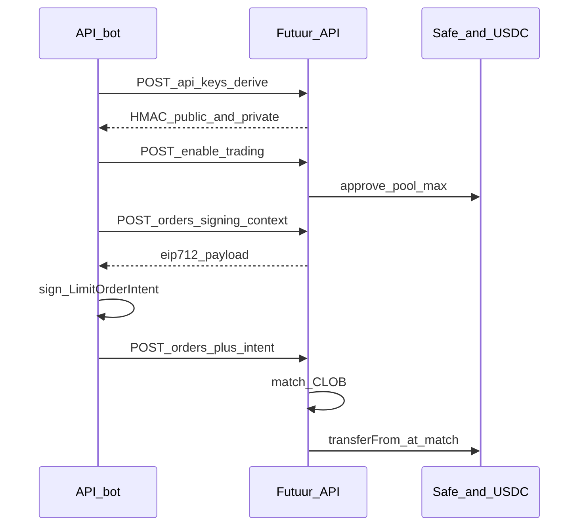

<Note>
  On-chain CLOB trading is coming soon. Today's production API still uses HMAC-only ledger settlement. This page describes the builder flow so you can prepare.
</Note>

Futuur is adding Polymarket-shaped on-chain settlement. The book still matches off-chain. Collateral (OOM or USDC) moves on-chain at match. HMAC authenticates HTTP. A wallet signature authorizes every create.

## How a bot trade works

1. [Get HMAC keys](/guides/get-api-keys) from Settings or wallet derive.
2. Enable trading once per token (standing `approve` of OOM or USDC to the pool).
3. Ask the API for a signing context, sign `LimitOrderIntent` with the **owner EOA**, then create the order.
4. The CLOB matches. Settlement `transferFrom`s run before share balances update.

See [Place an on-chain order](/guides/on-chain-first-order) for the step-by-step request flow.

## Matching

The matching engine is a **CLOB**. User orders match each other first. The platform AMM is backup liquidity — it does not jump a better-priced user order.

**Complementary both-buy** is a first-class match on binary markets. If you bid long at 0.55 and someone else bids short at 0.45, the prices sum to 1 and the orders can match without an ask on the book.

| Priority | What matches |
|---|---|
| 1 | User bid vs user ask at crossing prices |
| 1 | Complementary both-buy (bid Yes + bid No when prices sum to ≥ 1) |
| 2 | Leftover size may hit the AMM |

A filled on-chain order without an ERC-20 `Transfer` is a failure. The API does not credit shares until collateral has moved.

## Settlement at match

Shares stay in the Futuur database. Only the collateral token moves on-chain.

| Match type | On-chain transfer |
|---|---|
| Bid vs ask | Bidder Safe → asker Safe (via the pool) |
| Bid vs bid (both-buy) | Each user Safe → pool |
| Ask vs ask (both-sell) | Pool → each user Safe |

## Two-layer auth

| Layer | Mechanism | Who signs | Purpose |
|---|---|---|---|
| L2 (HTTP) | HMAC-SHA512 headers `Key`, `Timestamp`, `HMAC` | HMAC **private key** | Authenticate the REST call |
| L1 (order) | EIP-712 `LimitOrderIntent` (`FutuurLimitOrder` v1) | Safe **owner EOA** | Authorize that create |

HMAC never replaces the wallet signature. Get both credentials from [Get your API keys](/guides/get-api-keys).

## What stays the same

- Events, markets, and the existing [order](/concepts/orders) and [wager](/concepts/wagers) resources
- Play money (`OOM`) and real money (`USDC`) as [currencies](/concepts/currencies)
- HMAC signing for every authenticated request — see [Authentication](/authentication)

## Not in this release

These are not part of the first on-chain cutover:

- Conditional / outcome tokens on-chain (positions stay in the database)
- A dedicated exchange contract (settlement uses the pool Safe + ERC-20 `transferFrom`)
- An official TypeScript or Python SDK
- Separate CLOB, Gamma, or Relayer hosts — you still call `https://api.futuur.com`
